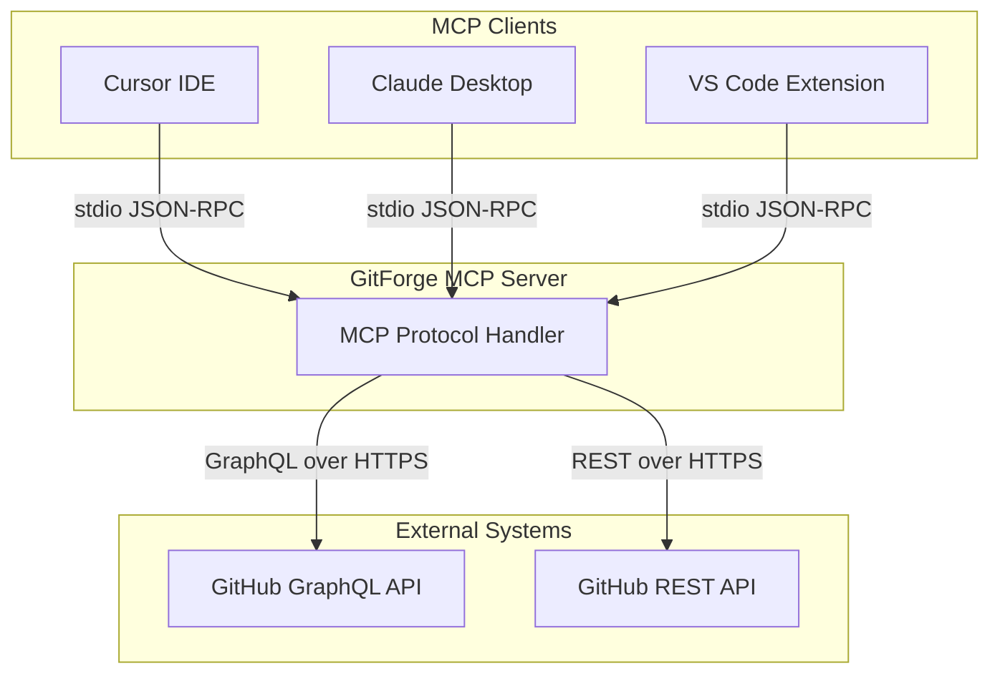
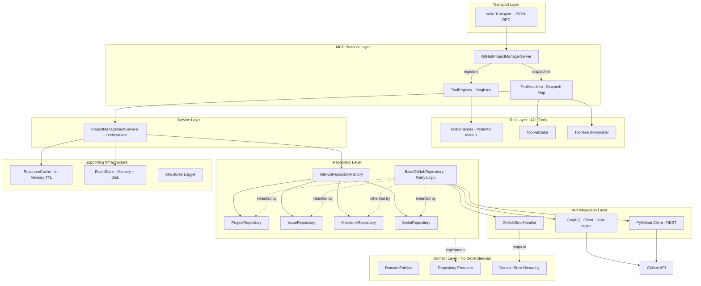
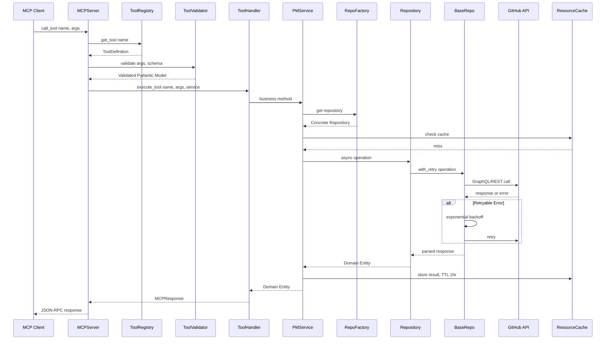
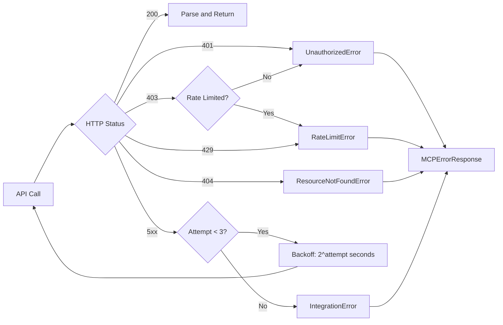

# STEP 1: EVALUATE AND PLAN -- GitForge MCP

**PROJECT**: GitForge MCP (suggested rename from "MCP GitHub Project Manager" -- stronger, brandable, memorable)
**STACK**: Python 3.8+, MCP SDK, Pydantic v2, GitHub GraphQL API, PyGithub, httpx, aiohttp, asyncio
**CORE IDEA**: An MCP protocol server that gives AI assistants full programmatic control over GitHub project management -- projects, issues, milestones, sprints, roadmaps -- through 47+ tools.

---

## 1. ARCHITECTURAL SOUNDNESS VERDICT

**Overall: 7.5/10 -- Architecturally solid, operationally incomplete.**

What is sound:

- Clean Architecture with proper layer separation (Domain -> Service -> Infrastructure -> Tools)
- Repository Pattern with Protocol-based dependency inversion -- textbook correct
- Factory Pattern for repository creation with token validation
- Retry with exponential backoff on all GitHub API calls (3 attempts, 1s/2s/4s)
- Pydantic v2 validation on all 47+ tool inputs -- no raw dicts flowing through the system
- Async/await throughout -- non-blocking I/O from entry to API call
- Error hierarchy is well-designed (DomainError -> specific errors with proper mapping from HTTP status codes)

What is NOT sound:

- Zero test files exist. Not one. For a 47-tool system touching a live API, this is the single biggest architectural gap.
- Sprint repository has 4 methods throwing `NotImplementedError` (`update`, `delete`, `find_current`, `remove_issue`) -- these are dead interfaces
- Event store disk persistence is stubbed ("simplified" in comments) -- it pretends to persist but doesn't reliably
- Cache is volatile (in-memory only) -- every server restart is a cold start
- No integration tests against GitHub API -- you don't know if your GraphQL queries actually work until runtime
- AI service layer (`ai_service_factory.py`) is pure scaffolding -- zero implementation

---

## 2. CRITICAL RISKS


| #   | Risk                                                   | Severity | Impact                                                         |
| --- | ------------------------------------------------------ | -------- | -------------------------------------------------------------- |
| 1   | Zero test coverage                                     | CRITICAL | Any refactor or dependency update can silently break 47+ tools |
| 2   | Sprint repo incomplete (4 NotImplementedError methods) | HIGH     | Users hitting these methods get unhelpful crashes              |
| 3   | No MCP server-side auth                                | HIGH     | Anyone with stdio access has full GitHub token access          |
| 4   | Token stored in plaintext in memory                    | MEDIUM   | Memory dump exposes GitHub credentials                         |
| 5   | In-memory cache lost on restart                        | MEDIUM   | Cold start latency spike, unnecessary API calls                |
| 6   | Event store persistence is fake                        | MEDIUM   | Events claimed to be persisted are actually lost               |
| 7   | No rate limiting on MCP side                           | MEDIUM   | Malicious/buggy client can burn through GitHub rate limits     |
| 8   | Single repo per server instance                        | LOW      | Cannot manage multiple repos without multiple server instances |
| 9   | AI layer is pure scaffolding                           | LOW      | Advertised feature that doesn't exist                          |
| 10  | No health check / monitoring                           | LOW      | No way to know if server is alive or degraded                  |


---

## 3. FULL ARCHITECTURE

### 3.1 System Context Diagram




### 3.2 Layered Architecture Diagram




### 3.3 Request Flow (Sequence)




### 3.4 Error Handling Flow




---

## 4. STATE AND DATA SCHEMA

### 4.1 Core Domain Entities

```
Issue
  id: str (GitHub node ID)
  number: int
  title: str
  description: Optional[str]
  status: ResourceStatus (ACTIVE | IN_PROGRESS | CLOSED | ARCHIVED)
  assignees: List[str]
  labels: List[str]
  milestone_id: Optional[str]
  created_at: str (ISO 8601)
  updated_at: str (ISO 8601)
  url: str

Project
  id: str (GitHub node ID, e.g. PVT_kwDO...)
  type: str
  title: str
  description: Optional[str]
  owner: str
  number: int
  url: str
  fields: List[CustomField]
  views: List[ProjectView]
  closed: bool
  status: ResourceStatus
  visibility: str (public | private)
  version: int

Milestone
  id: str
  number: int
  title: str
  description: Optional[str]
  due_date: Optional[str]
  status: ResourceStatus
  progress: Dict (open_issues, closed_issues, completion_percentage)

Sprint
  id: str
  title: str
  description: Optional[str]
  start_date: str
  end_date: str
  status: ResourceStatus
  issues: List[str] (issue IDs)

CustomField
  id: str
  name: str
  type: FieldType (text | number | date | single_select | iteration | ...)
  options: List[FieldOption]
  description: Optional[str]
  required: bool

IssueComment
  id: str
  body: str
  author: str
  created_at: str
  updated_at: str
```

### 4.2 Cache Schema

```
Key format: "{ResourceType}:{ResourceId}"
Example:    "issue:I_kwDOAbc123"

CacheEntry[T]
  value: T (any domain entity)
  expires_at: float (Unix timestamp)
  tags: List[str] (e.g. ["sprint-1", "high-priority"])
  namespace: Optional[str]
  last_modified: float
  version: int

Indices:
  _type_index:      Dict[ResourceType, Set[str]]     -- fast type lookups
  _tag_index:       Dict[str, Set[str]]               -- fast tag queries
  _namespace_index: Dict[str, Set[str]]               -- fast namespace queries
```

### 4.3 Event Schema

```
ResourceEvent
  id: str (UUID)
  type: str (event type name)
  resource_type: str (PROJECT | ISSUE | MILESTONE | SPRINT)
  resource_id: str
  source: str
  timestamp: str (ISO 8601)
  data: Dict[str, Any]
  metadata: Dict[str, Any]
```

---

## 5. COMPONENT INPUT/OUTPUT CONTRACTS

### 5.1 MCP Server


| Method                  | Input                 | Output                                           |
| ----------------------- | --------------------- | ------------------------------------------------ |
| `list_tools()`          | None                  | `List[Tool]` with name, description, inputSchema |
| `call_tool(name, args)` | tool name + JSON args | `List[TextContent]` with JSON result             |


### 5.2 Tool Validator


| Method                                | Input                         | Output                            |
| ------------------------------------- | ----------------------------- | --------------------------------- |
| `validate(tool_name, args, schema)`   | raw dict/str + Pydantic class | Validated Pydantic model instance |
| `handle_tool_error(error, tool_name)` | Exception + tool name         | `MCPErrorResponse`                |


### 5.3 Tool Handlers (each handler follows this pattern)


| Input                                  | Processing                                                       | Output                                     |
| -------------------------------------- | ---------------------------------------------------------------- | ------------------------------------------ |
| `service: PMService, args: dict/Model` | Extract args -> Call service method -> Convert dataclass to dict | `MCPSuccessResponse` or `MCPErrorResponse` |


### 5.4 ProjectManagementService (key methods)


| Method                              | Input                                   | Output                               |
| ----------------------------------- | --------------------------------------- | ------------------------------------ |
| `create_project(CreateProject)`     | DTO with title, owner, visibility       | `Project` entity                     |
| `create_issue(CreateIssue)`         | DTO with title, description, labels     | `Issue` entity                       |
| `create_milestone(CreateMilestone)` | DTO with title, due_date                | `Milestone` entity                   |
| `create_sprint(CreateSprint)`       | DTO with title, dates, issues           | `Sprint` entity                      |
| `create_roadmap(args)`              | Project + milestones + issues structure | `Dict` with created resources        |
| `get_milestone_metrics(id)`         | milestone ID                            | `Dict` with progress, days remaining |
| `get_sprint_metrics(id)`            | sprint ID                               | `Dict` with completion %, issues     |


### 5.5 Repositories (via Protocol interface)


| Method                    | Input                   | Output             |
| ------------------------- | ----------------------- | ------------------ |
| `create(data: CreateDTO)` | Creation DTO            | Domain entity      |
| `find_by_id(id: str)`     | Entity ID               | `Optional[Entity]` |
| `find_all()`              | None                    | `List[Entity]`     |
| `update(id, data)`        | Entity ID + update dict | Updated entity     |
| `delete(id)`              | Entity ID               | None               |


### 5.6 GraphQL Client


| Method                      | Input                          | Output                        |
| --------------------------- | ------------------------------ | ----------------------------- |
| `execute(query, variables)` | GraphQL string + variable dict | `Dict` (parsed JSON response) |


### 5.7 ResourceCache


| Method                          | Input                                     | Output                           |
| ------------------------------- | ----------------------------------------- | -------------------------------- |
| `set(type, id, value, options)` | ResourceType + ID + entity + CacheOptions | None                             |
| `get(type, id)`                 | ResourceType + ID                         | `Optional[T]` or None if expired |
| `get_by_type(type)`             | ResourceType                              | `List[T]`                        |
| `get_by_tag(tag)`               | Tag string                                | `List[T]`                        |


---

## 6. PROJECT STRUCTURE

```
git_proj_manger_mcp/
|-- src/
|   |-- __init__.py
|   |-- __main__.py                          # Server entry point
|   |-- cli.py                               # CLI argument parser
|   |-- env.py                               # Env config loader
|   |
|   |-- domain/                              # DOMAIN LAYER (zero dependencies)
|   |   |-- __init__.py
|   |   |-- types.py                         # Entities + Protocols + DTOs
|   |   |-- errors.py                        # Error hierarchy
|   |   |-- mcp_types.py                     # MCP protocol types
|   |   |-- resource_types.py                # Enums + Resource base
|   |   |-- ai_types.py                      # AI entity types (future)
|   |
|   |-- services/                            # SERVICE LAYER
|   |   |-- __init__.py
|   |   |-- project_management_service.py    # Main orchestrator (700+ lines)
|   |   |-- ai/
|   |       |-- __init__.py
|   |       |-- ai_service_factory.py        # AI provider factory (stub)
|   |
|   |-- infrastructure/                      # INFRASTRUCTURE LAYER
|       |-- __init__.py
|       |
|       |-- github/                          # GitHub API integration
|       |   |-- __init__.py
|       |   |-- github_config.py             # Config dataclass
|       |   |-- github_error_handler.py      # Error mapping + retry detection
|       |   |-- github_repository_factory.py # Factory for all repos
|       |   |-- graphql_types.py             # GraphQL type mappers
|       |   |
|       |   |-- repositories/               # Concrete repository implementations
|       |   |   |-- __init__.py
|       |   |   |-- base_repository.py       # Base with retry logic
|       |   |   |-- github_issue_repository.py
|       |   |   |-- github_milestone_repository.py
|       |   |   |-- github_project_repository.py
|       |   |   |-- github_sprint_repository.py
|       |   |
|       |   |-- util/                        # API utilities
|       |       |-- __init__.py
|       |       |-- graphql_client.py        # Async GraphQL client
|       |       |-- graphql_helpers.py        # Helper functions
|       |       |-- github_api_util.py       # REST utilities
|       |
|       |-- tools/                           # MCP Tool Layer
|       |   |-- __init__.py
|       |   |-- tool_registry.py             # Singleton registry (47+ tools)
|       |   |-- tool_schemas.py              # Pydantic schemas (40+ models)
|       |   |-- tool_validator.py            # Arg validation
|       |   |-- tool_handlers.py             # Execution handlers
|       |   |-- tool_result_formatter.py     # Response formatting
|       |
|       |-- mcp/                             # MCP protocol helpers
|       |   |-- __init__.py
|       |   |-- mcp_response_formatter.py
|       |
|       |-- cache/                           # Caching
|       |   |-- __init__.py
|       |   |-- resource_cache.py            # In-memory TTL cache
|       |
|       |-- events/                          # Event system
|       |   |-- __init__.py
|       |   |-- event_store.py               # Event storage
|       |   |-- event_subscription_manager.py
|       |
|       |-- logger/                          # Logging
|           |-- __init__.py
|
|-- docs/
|   |-- mcp/github-projects-integration.md
|   |-- tutorials/getting-started.md
|   |-- user-guide.md
|
|-- .env.example
|-- .gitignore
|-- .dockerignore
|-- requirements.txt
|-- pyproject.toml
|-- README.md
|-- ARCHITECTURE.md
|-- CHANGELOG.md
|-- CONTRIBUTING.md
|-- LICENSE
|-- cursor-mcp-config.json.example
|-- delete_all_projects_and_issues.py
```

---

## 7. BUILD ORDER (Phased with Milestones)

### Phase 0: Foundation (DONE)

- Domain layer with entities, protocols, errors
- Infrastructure with GitHub API integration
- Service layer orchestration
- 47+ MCP tools registered and functional
- CLI + env config
- Documentation

### Phase 1: Stability (NEXT -- Critical)

**Milestone: "Production-Ready Core"**

- Write unit tests for all 47 tool handlers (mock service layer)
- Write unit tests for ToolValidator edge cases
- Write integration tests for repository layer (mock GraphQL responses)
- Fix Sprint repository: implement the 4 `NotImplementedError` methods or remove them from the Protocol
- Add input sanitization on all string fields (XSS/injection prevention)
- **Target: 80%+ test coverage on service + tool layers**

### Phase 2: Resilience

**Milestone: "Reliable Operations"**

- Replace in-memory cache with optional Redis backend (keep in-memory as fallback)
- Complete event store disk persistence (currently stubbed)
- Add health check endpoint
- Add MCP server-side rate limiting (protect GitHub token budget)
- Add structured logging with correlation IDs per request
- Add metrics collection (tool call counts, latency percentiles, error rates)

### Phase 3: Multi-Repo + Auth

**Milestone: "Enterprise-Ready"**

- Support multiple repositories per server instance (multi-tenant)
- Add token encryption at rest
- Add MCP-level authentication (token-based or OAuth)
- Add webhook support for real-time GitHub event ingestion
- Add SSE transport option alongside stdio

### Phase 4: Intelligence Layer

**Milestone: "AI-Powered"**

- Implement AI service factory (Anthropic/OpenAI/Google providers)
- AI-powered task generation from PRDs
- Smart sprint planning (auto-assign based on velocity)
- Natural language to GitHub query translation
- Dependency graph analysis

### Phase 5: Distribution

**Milestone: "Published Package"**

- PyPI package publication (`pip install gitforge-mcp`)
- Docker image on GitHub Container Registry
- One-click deploy templates (Railway, Fly.io)
- VS Code extension marketplace listing
- GitHub Actions integration

---

**Bottom line**: The architecture is genuinely good -- Clean Architecture done correctly in Python with proper async, type safety, and error handling. The critical gap is not design, it is verification (tests) and operational maturity (monitoring, persistence, auth). Phase 1 is non-negotiable before calling this production-grade.