# STEP 6: System Design -- HLD + LLD

# GitForge MCP -- Complete System Design Document

---

# PART A: HIGH-LEVEL DESIGN (HLD)

---

## 1. System Context

The system is an MCP (Model Context Protocol) server that sits between AI assistants and GitHub's API. It receives structured tool calls from AI clients over stdio, translates them into GitHub API operations, and returns structured responses.

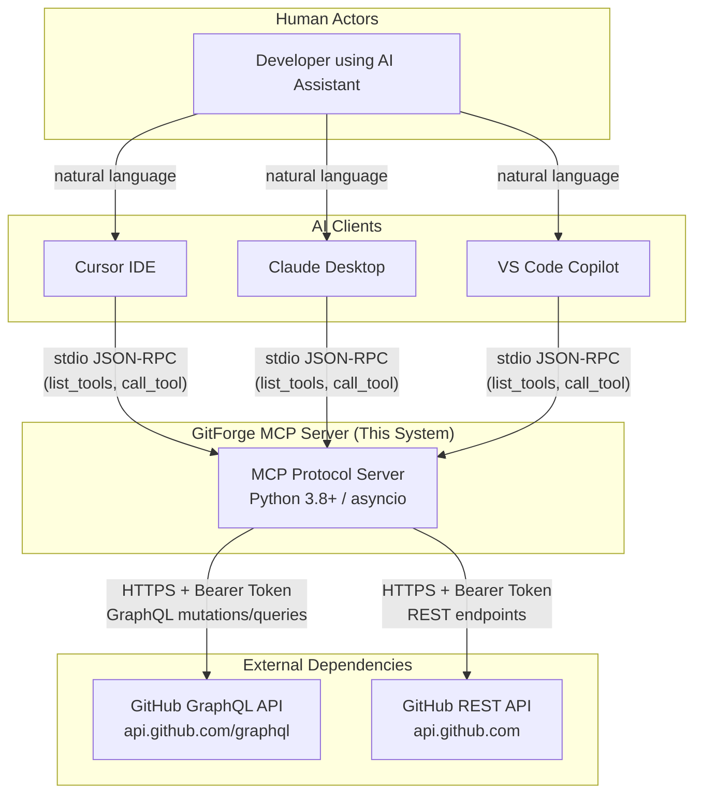


**Key constraint:** The server is a child process spawned by the AI client. Communication is strictly over stdin/stdout using JSON-RPC. There is no HTTP server, no port binding, no network listener.

---

## 2. Component Architecture

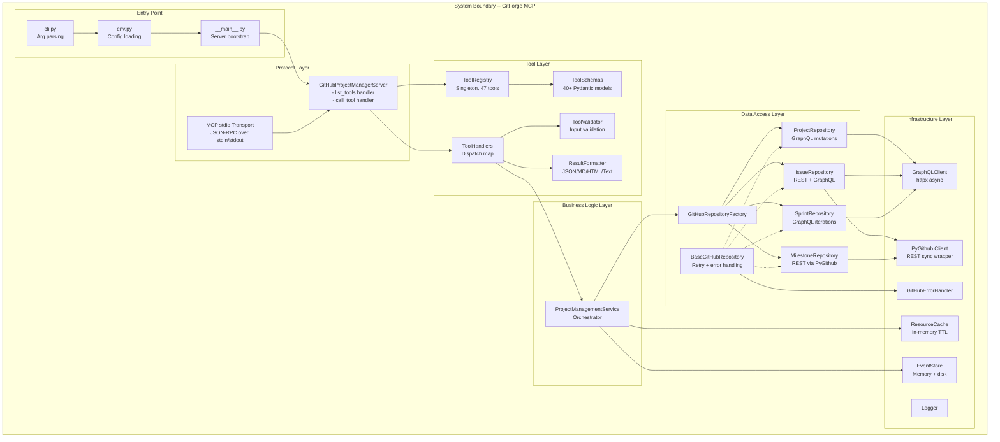


---

## 3. Data Flow Diagrams

### 3.1 Tool Execution Flow (Happy Path)

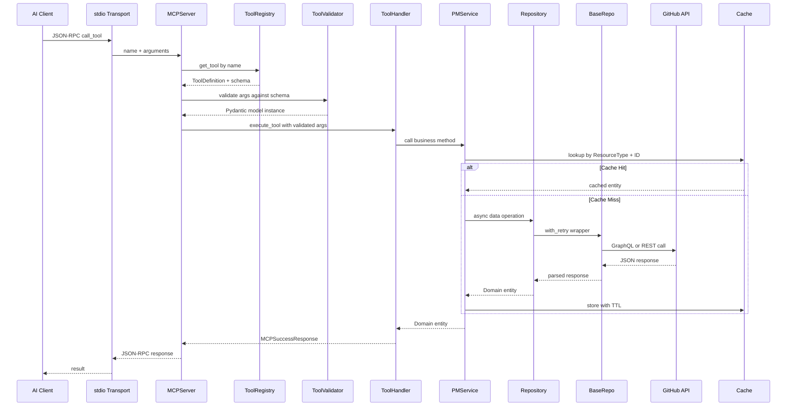


### 3.2 Roadmap Creation Flow (Complex Multi-Step)

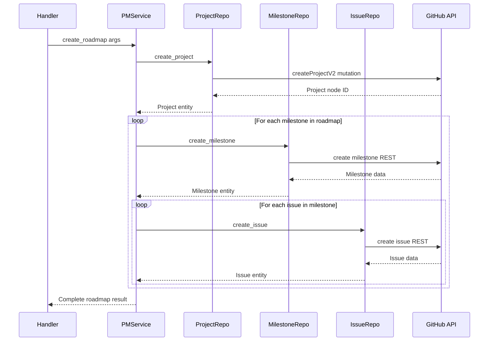


### 3.3 Retry Flow (Error Path)

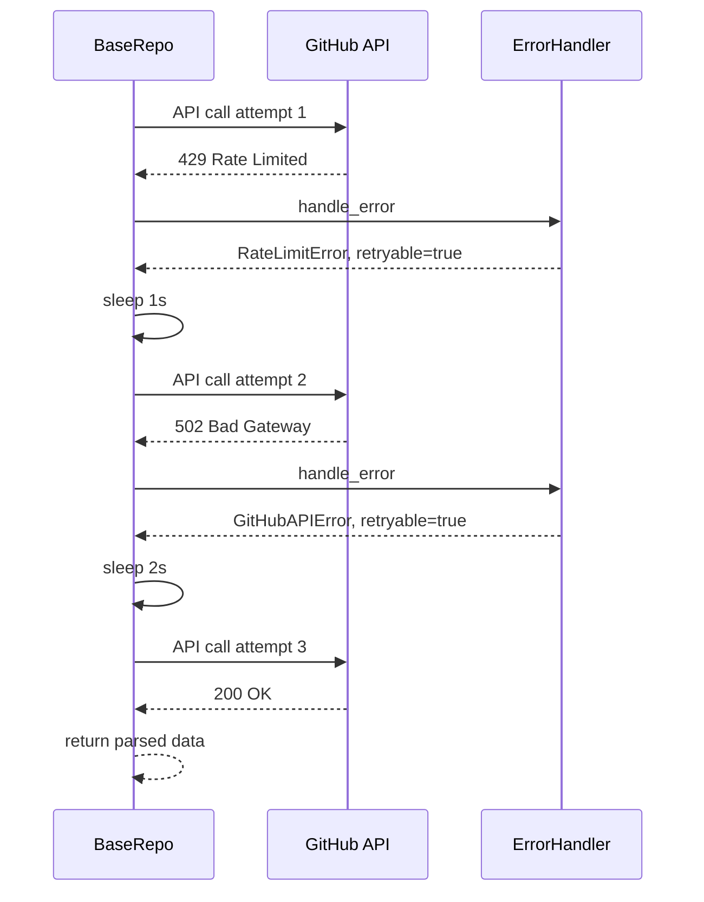


---

## 4. Non-Functional Requirements


| Requirement          | Current State                                | Target                                     |
| -------------------- | -------------------------------------------- | ------------------------------------------ |
| **Latency**          | 150-500ms per tool call (API-bound)          | Acceptable -- GitHub API is the bottleneck |
| **Throughput**       | Sequential tool calls only (stdio is serial) | N/A -- inherent MCP limitation             |
| **Availability**     | Process lifecycle tied to AI client          | Acceptable for stdio transport             |
| **Cache Hit Rate**   | 60-80% for repeated reads                    | Good for read-heavy patterns               |
| **Retry Resilience** | 3 attempts, exponential backoff              | Handles transient GitHub failures          |
| **Error Recovery**   | Graceful degradation to error response       | No tool call crashes the server            |
| **Memory**           | 10-50MB depending on cache size              | Acceptable for a child process             |
| **Startup Time**     | <2s (import + GitHub client init)            | Acceptable                                 |
| **Concurrency**      | Single-threaded async event loop             | Matches stdio serial nature                |
| **Security**         | Token in env var, no encryption at rest      | Minimum viable for local tool              |


---

---

# PART B: LOW-LEVEL DESIGN (LLD)

---

## 5. Module Design

### 5.1 Module Dependency Graph

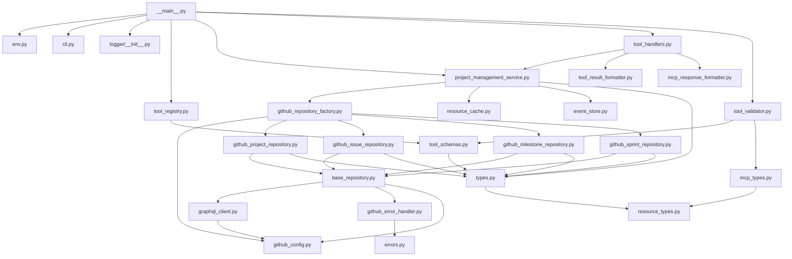


### 5.2 Module Responsibilities (Single Responsibility)


| Module                           | Responsibility                              | Lines (approx) | Dependencies                |
| -------------------------------- | ------------------------------------------- | -------------- | --------------------------- |
| `__main__.py`                    | Bootstrap server, wire handlers             | ~120           | env, cli, registry, service |
| `env.py`                         | Load config from CLI + env + .env file      | ~150           | cli, dotenv                 |
| `tool_registry.py`               | Register + discover 47 tools                | ~150           | tool_schemas                |
| `tool_schemas.py`                | Define 40+ Pydantic input models            | ~900           | domain types                |
| `tool_validator.py`              | Validate + coerce tool arguments            | ~200           | schemas, mcp_types          |
| `tool_handlers.py`               | Execute tool logic, dispatch map            | ~1200          | service, formatter          |
| `tool_result_formatter.py`       | Format results as JSON/MD/HTML              | ~200           | mcp_types                   |
| `project_management_service.py`  | Orchestrate business operations             | ~700           | factory, cache, events      |
| `github_repository_factory.py`   | Create repo instances, validate token       | ~120           | config, repos               |
| `base_repository.py`             | Retry logic, error handling, GraphQL access | ~100           | gql_client, error_handler   |
| `github_project_repository.py`   | GitHub Projects v2 GraphQL CRUD             | ~800           | base_repo, gql_client       |
| `github_issue_repository.py`     | Issue CRUD with REST fallback               | ~500           | base_repo, PyGithub         |
| `github_milestone_repository.py` | Milestone CRUD via REST                     | ~250           | base_repo, PyGithub         |
| `github_sprint_repository.py`    | Sprint/iteration via GraphQL                | ~400           | base_repo, gql_client       |
| `graphql_client.py`              | Execute GraphQL queries async               | ~100           | httpx, config               |
| `github_error_handler.py`        | Map HTTP errors to domain errors            | ~100           | domain errors               |
| `resource_cache.py`              | In-memory cache with TTL + indices          | ~250           | resource_types              |
| `event_store.py`                 | Event storage with memory + disk            | ~300           | resource_types              |


---

## 6. State Machine Transitions

### 6.1 Issue Lifecycle

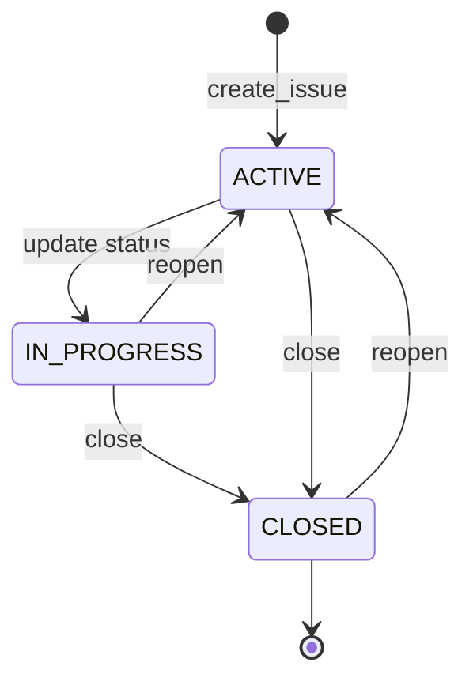


### 6.2 Sprint Lifecycle

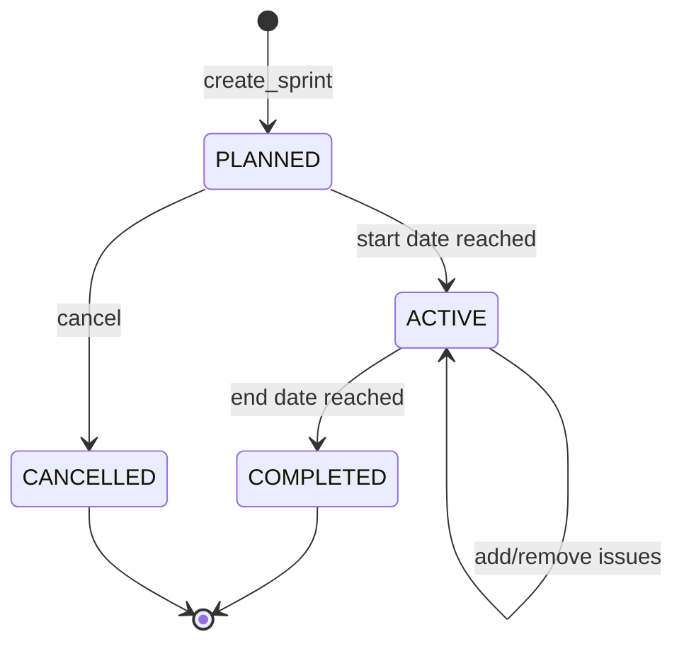


### 6.3 Milestone Lifecycle

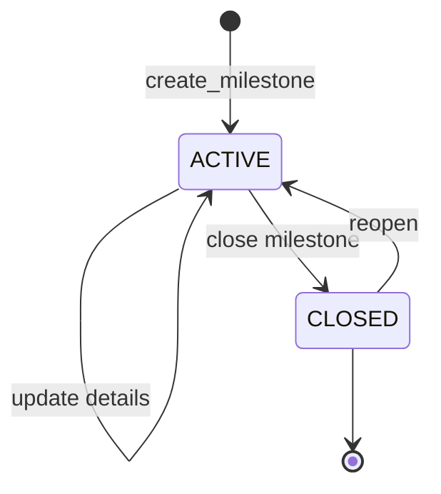


### 6.4 Project Lifecycle

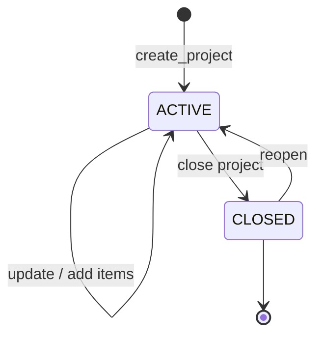


### 6.5 Cache Entry Lifecycle

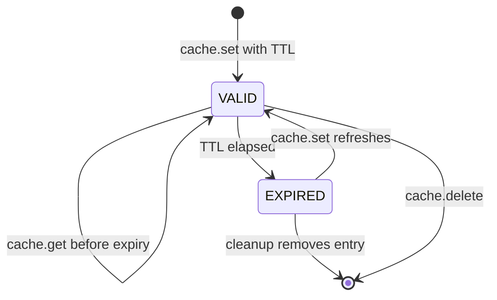


### 6.6 MCP Request Lifecycle

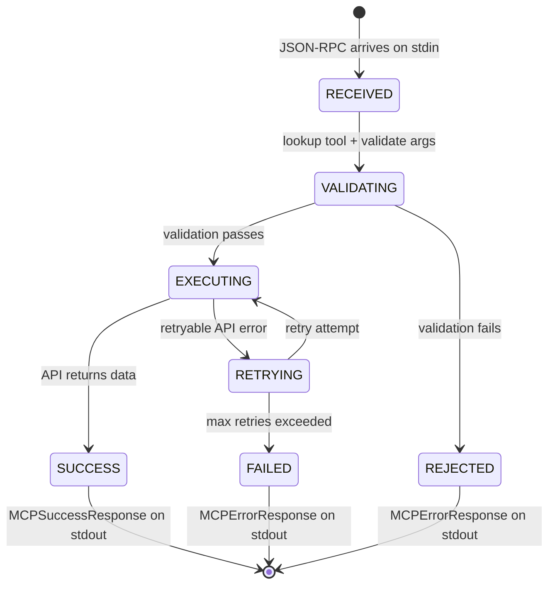


---

## 7. Complete Data Models

### 7.1 Domain Entities

```python
# Issue
@dataclass
class Issue:
    id: str                          # GitHub node ID (e.g. "I_kwDOAbc123")
    number: int                      # Human-readable number
    title: str
    description: Optional[str]
    status: ResourceStatus           # ACTIVE | IN_PROGRESS | CLOSED
    assignees: List[str]             # GitHub usernames
    labels: List[str]                # Label names
    milestone_id: Optional[str]      # Milestone number as string
    created_at: str                  # ISO 8601
    updated_at: str                  # ISO 8601
    url: str                         # GitHub web URL

# Project
@dataclass
class Project:
    id: str                          # GitHub node ID (e.g. "PVT_kwDO...")
    type: str                        # Always "ProjectV2"
    title: str
    description: Optional[str]
    owner: str                       # GitHub username or org
    number: int
    url: str
    fields: List[CustomField]
    views: List[ProjectView]
    closed: bool
    created_at: str
    updated_at: str
    status: ResourceStatus
    visibility: str                  # "public" | "private"
    version: int

# Milestone
@dataclass
class Milestone:
    id: str
    number: int
    title: str
    description: Optional[str]
    due_date: Optional[str]          # ISO 8601 date
    status: ResourceStatus
    created_at: str
    updated_at: str
    url: str
    progress: Dict[str, Any]         # {open_issues, closed_issues, completion_percentage}

# Sprint
@dataclass
class Sprint:
    id: str
    title: str
    description: Optional[str]
    start_date: str                  # ISO 8601
    end_date: str                    # ISO 8601
    status: ResourceStatus           # PLANNED | ACTIVE | COMPLETED
    issues: List[str]                # Issue IDs
    created_at: str
    updated_at: str

# CustomField
@dataclass
class CustomField:
    id: str
    name: str
    type: FieldType                  # text | number | date | single_select | iteration
    options: List[FieldOption]       # For single_select fields
    description: Optional[str]
    required: bool
    default_value: Optional[Any]
    validation: Optional[Dict]
    config: Optional[Dict]

# IssueComment
@dataclass
class IssueComment:
    id: str
    body: str
    author: str
    created_at: str
    updated_at: str
```

### 7.2 Creation DTOs (Data Transfer Objects)

```python
@dataclass
class CreateIssue:
    title: str
    description: Optional[str] = None
    assignees: List[str] = field(default_factory=list)
    labels: List[str] = field(default_factory=list)
    milestone_id: Optional[str] = None

@dataclass
class CreateProject:
    title: str
    owner: str
    description: Optional[str] = None
    visibility: str = "private"

@dataclass
class CreateMilestone:
    title: str
    description: Optional[str] = None
    due_date: Optional[str] = None

@dataclass
class CreateSprint:
    title: str
    description: Optional[str] = None
    start_date: str = ""
    end_date: str = ""
    project_id: Optional[str] = None
    issue_ids: List[str] = field(default_factory=list)
```

---

## 8. API Contracts (All 47+ MCP Tools)

### 8.1 Project Tools

```
create_project
  IN:  { title: str, owner: str, visibility?: "public"|"private", short_description?: str }
  OUT: { id, title, owner, url, visibility, status }

list_projects
  IN:  { status?: "active"|"closed", limit?: int }
  OUT: [ { id, title, status, url } ... ]

get_project
  IN:  { project_id: str }
  OUT: { id, title, description, owner, fields, views, status }

update_project
  IN:  { project_id: str, title?: str, description?: str, visibility?: str, status?: str }
  OUT: { id, title, status }

delete_project
  IN:  { project_id: str }
  OUT: { success: true }
```

### 8.2 Issue Tools

```
create_issue
  IN:  { title: str, description?: str, labels?: [str], assignees?: [str],
         milestone_id?: str, priority?: str, type?: str }
  OUT: { id, number, title, status, url }

list_issues
  IN:  { status?: "open"|"closed"|"all", assignee?: str, labels?: [str],
         milestone?: str, sort?: str, direction?: str, limit?: int }
  OUT: [ { id, number, title, status, labels } ... ]

get_issue
  IN:  { issue_id: str }
  OUT: { id, number, title, description, status, assignees, labels, url }

update_issue
  IN:  { issue_id: str, title?: str, description?: str, status?: str,
         labels?: [str], assignees?: [str], milestone_id?: str,
         project_id?: str, project_field_values?: dict }
  OUT: { id, number, title, status }

search_issues
  IN:  { query: str }  // GitHub search syntax: "is:open label:bug"
  OUT: [ { id, number, title, status, labels } ... ]
```

### 8.3 Comment Tools

```
add_issue_comment
  IN:  { issue_id: str, body: str }
  OUT: { id, body, author, created_at }

list_issue_comments
  IN:  { issue_id: str }
  OUT: [ { id, body, author, created_at } ... ]

update_issue_comment
  IN:  { issue_id: str, comment_id: str, body: str }
  OUT: { id, body, updated_at }

delete_issue_comment
  IN:  { issue_id: str, comment_id: str }
  OUT: { success: true }
```

### 8.4 Milestone Tools

```
create_milestone
  IN:  { title: str, description?: str, due_date?: str }
  OUT: { id, number, title, due_date, status }

list_milestones
  IN:  { status?: "open"|"closed"|"all", sort?: str, direction?: str }
  OUT: [ { id, number, title, due_date, status } ... ]

update_milestone
  IN:  { milestone_id: str, title?: str, description?: str, due_date?: str, state?: str }
  OUT: { id, number, title, status }

delete_milestone
  IN:  { milestone_id: str }
  OUT: { success: true }

get_milestone_metrics
  IN:  { milestone_id: str, include_issues?: bool }
  OUT: { open_issues, closed_issues, completion_percentage, days_remaining, issues? }

get_overdue_milestones
  IN:  { limit: int, include_issues?: bool }
  OUT: [ { id, title, due_date, days_overdue, metrics } ... ]

get_upcoming_milestones
  IN:  { days_ahead: int, limit: int, include_issues?: bool }
  OUT: [ { id, title, due_date, days_until_due, metrics } ... ]
```

### 8.5 Sprint Tools

```
create_sprint
  IN:  { title: str, description: str, start_date: str, end_date: str, issue_ids?: [str] }
  OUT: { id, title, start_date, end_date, status }

plan_sprint
  IN:  { sprint: { title, start_date, end_date, goals?: [str] }, issue_ids?: [str] }
  OUT: { sprint, assigned_issues }

list_sprints
  IN:  { status?: "all"|"active"|"completed"|"planned" }
  OUT: [ { id, title, start_date, end_date, status } ... ]

get_current_sprint
  IN:  { include_issues?: bool }
  OUT: { id, title, start_date, end_date, issues? }

update_sprint
  IN:  { sprint_id: str, title?: str, description?: str, status?: str,
         start_date?: str, end_date?: str }
  OUT: { id, title, status }

add_issues_to_sprint
  IN:  { sprint_id: str, issue_ids: [str] }
  OUT: { sprint_id, added_issues }

remove_issues_from_sprint
  IN:  { sprint_id: str, issue_ids: [str] }
  OUT: { sprint_id, removed_issues }

get_sprint_metrics
  IN:  { sprint_id: str, include_issues?: bool }
  OUT: { total_issues, completed, in_progress, completion_percentage }
```

### 8.6 Roadmap Tool

```
create_roadmap
  IN:  {
    project: { title: str, visibility: str, short_description?: str },
    milestones: [
      {
        milestone: { title: str, description: str, due_date?: str },
        issues?: [ { title: str, description: str, labels?: [str],
                     assignees?: [str], priority?: str, type?: str } ]
      }
    ]
  }
  OUT: { project, milestones: [ { milestone, issues } ] }
```

### 8.7 Field, View, Item, Label Tools

```
create_project_field
  IN:  { project_id: str, name: str, type: str, options?: any, description?: str }
  OUT: { id, name, type, options }

list_project_fields
  IN:  { project_id: str }
  OUT: [ { id, name, type, options } ... ]

create_project_view
  IN:  { project_id: str, name: str, layout: "board"|"table"|"timeline"|"roadmap" }
  OUT: { id, name, layout }

add_project_item
  IN:  { project_id: str, content_id: str, content_type: str, priority?: str, type?: str }
  OUT: { item_id, content_id }

set_field_value
  IN:  { project_id: str, item_id: str, field_id: str, value: any }
  OUT: { item_id, field_id, value }

filter_project_items
  IN:  { project_id: str, field_filters: dict }
  OUT: [ { item_id, content_id, field_values } ... ]

create_label
  IN:  { name: str, color: str, description?: str }
  OUT: { name, color, description }

list_labels
  IN:  { limit?: int }
  OUT: [ { name, color, description } ... ]
```

---

## 9. Error Handling Flows

### 9.1 Error Hierarchy

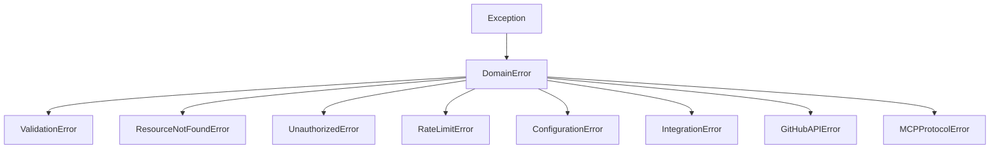


### 9.2 Error Mapping Table

```
GitHub HTTP 401   --> UnauthorizedError     --> MCPErrorCode.UNAUTHORIZED
GitHub HTTP 403   --> UnauthorizedError     --> MCPErrorCode.UNAUTHORIZED
  (if rate limit) --> RateLimitError        --> MCPErrorCode.RATE_LIMITED
GitHub HTTP 404   --> ResourceNotFoundError --> MCPErrorCode.RESOURCE_NOT_FOUND
GitHub HTTP 429   --> RateLimitError        --> MCPErrorCode.RATE_LIMITED
GitHub HTTP 5xx   --> GitHubAPIError        --> MCPErrorCode.INTERNAL_ERROR
Pydantic failure  --> ValidationError       --> MCPErrorCode.VALIDATION_ERROR
Network timeout   --> IntegrationError      --> MCPErrorCode.INTERNAL_ERROR
Unknown exception --> DomainError           --> MCPErrorCode.INTERNAL_ERROR
```

### 9.3 Retry Decision Matrix

```
Error Code  | Retryable | Max Attempts | Backoff
------------|-----------|--------------|--------
429         | YES       | 3            | Rate-limit reset header or 2^n seconds
500         | YES       | 3            | 1s, 2s, 4s
502         | YES       | 3            | 1s, 2s, 4s
503         | YES       | 3            | 1s, 2s, 4s
504         | YES       | 3            | 1s, 2s, 4s
Network err | YES       | 3            | 1s, 2s, 4s
400         | NO        | 0            | --
401         | NO        | 0            | --
403         | NO        | 0            | --
404         | NO        | 0            | --
422         | NO        | 0            | --
```

---

## 10. Storage Schemas

### 10.1 In-Memory Cache Schema

```
Storage: Dict[str, CacheEntry]

Key format: "{ResourceType}:{ResourceId}"
Examples:
  "PROJECT:PVT_kwDOAbc123"
  "ISSUE:I_kwDOXyz789"
  "MILESTONE:42"
  "SPRINT:iter_abc"

CacheEntry[T]:
  value: T                    # Domain entity (Issue, Project, etc.)
  expires_at: float           # Unix timestamp = now + TTL
  tags: List[str]             # ["sprint-1", "high-priority", "bug"]
  namespace: Optional[str]    # Multi-tenant isolation key
  last_modified: float        # Unix timestamp of last write
  version: int                # Optimistic concurrency version

Indices (derived, kept in sync):
  _type_index:      Dict[ResourceType, Set[cache_key]]
  _tag_index:       Dict[str, Set[cache_key]]
  _namespace_index: Dict[str, Set[cache_key]]

Default TTL: 3,600,000ms (1 hour)
Eviction: Lazy on read (check expires_at) + periodic cleanup
```

### 10.2 Event Store Schema

```
Memory Buffer: List[ResourceEvent] (max 10,000, FIFO overflow)

ResourceEvent:
  id: str                     # UUID v4
  type: str                   # "CREATED" | "UPDATED" | "DELETED"
  resource_type: str           # "PROJECT" | "ISSUE" | "MILESTONE" | "SPRINT"
  resource_id: str             # Entity ID
  source: str                  # "mcp-tool" | "webhook" | "system"
  timestamp: str               # ISO 8601
  data: Dict[str, Any]         # Event payload (before/after state)
  metadata: Dict[str, Any]     # Context (user, tool_name, request_id)

Disk Storage (planned):
  Directory: .mcp-cache/events/
  Files: events_YYYY-MM-DD.jsonl (one JSON per line)
  Rotation: 10,000 events per file
  Retention: 30 days (configurable)
  Compression: Optional gzip
```

### 10.3 Configuration Schema

```
Required:
  GITHUB_TOKEN: str           # "ghp_..." or "github_pat_..."
  GITHUB_OWNER: str           # Username or org name
  GITHUB_REPO: str            # Repository name

Optional (with defaults):
  SYNC_ENABLED: bool          # true
  SYNC_TIMEOUT_MS: int        # 5000
  CACHE_DIRECTORY: str        # ".cache"
  WEBHOOK_SECRET: str         # ""
  WEBHOOK_PORT: int           # 3000
  SSE_ENABLED: bool           # false
  EVENT_RETENTION_DAYS: int   # 30
  MAX_EVENTS_IN_MEMORY: int   # 10000

AI Config (all optional):
  ANTHROPIC_API_KEY: str
  OPENAI_API_KEY: str
  GOOGLE_API_KEY: str
  PERPLEXITY_API_KEY: str
  AI_MAIN_MODEL: str
  AI_RESEARCH_MODEL: str
```

---

## 11. Infrastructure Topology

### 11.1 Current (Local/Dev)

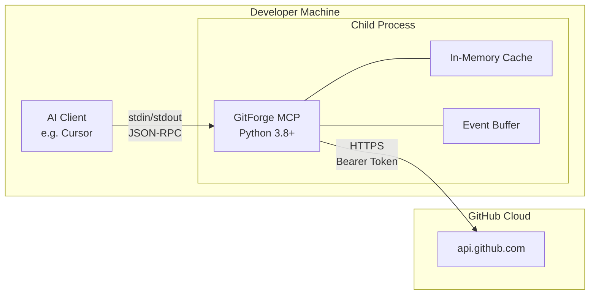


### 11.2 Future (Containerized/Production)

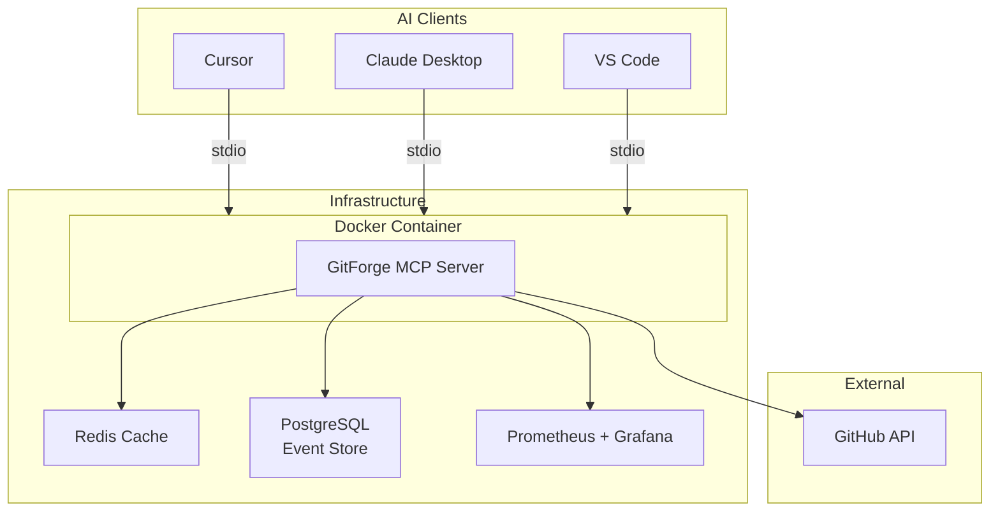


---

## 12. Key Design Constraints

1. **stdio-only transport**: The server cannot expose HTTP endpoints. All communication is stdin/stdout JSON-RPC. This means no webhooks can be received directly -- they would need a sidecar process.
2. **Single-threaded async**: Python's asyncio event loop is single-threaded. All I/O is non-blocking but CPU-bound operations block the loop. GraphQL response parsing is the heaviest CPU operation.
3. **GitHub API rate limits**: 5,000 requests/hour for authenticated users. With 47 tools and potential AI chaining, a single conversation could burn through hundreds of requests. The cache is the primary mitigation.
4. **GitHub Projects v2 is GraphQL-only**: Cannot use REST for project operations. Must maintain complex GraphQL queries for field types, views, items, and iterations.
5. **Sprints are not a GitHub primitive**: Sprints are implemented as iteration fields on Projects v2. This means sprint operations require multiple GraphQL calls (find/create iteration field, then set values on items).
6. **No persistent state**: The server is stateless across restarts. Cache, events, and sprint state are all volatile. This is acceptable for the current use case but limits advanced features.

